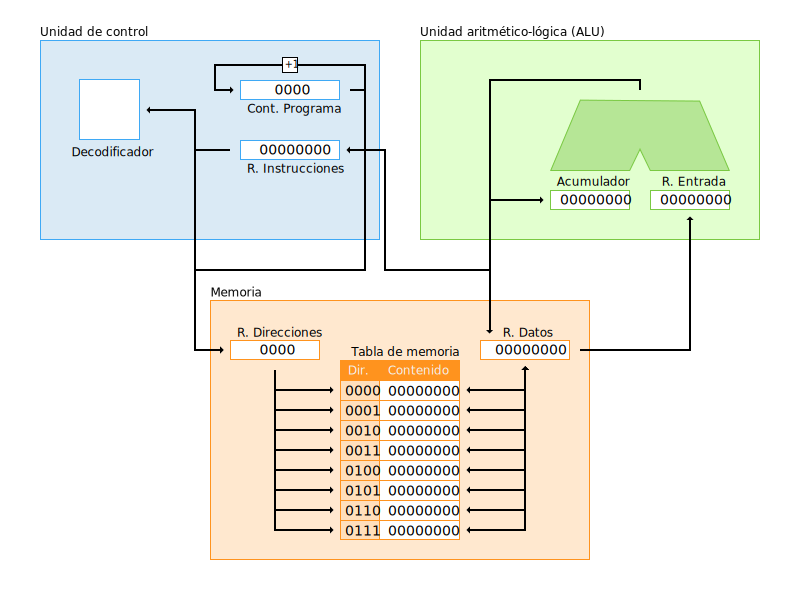

# Simulador Von Neumann

Este proyecto simula la [arquitectura Von Neumann](https://es.wikipedia.org/wiki/Arquitectura_de_Von_Neumann) permitiendo ejecutar un set de instrucciones de 4 bits. Este es un proyecto educativo que trata de acercar a estudiantes el funcionamiento interno de un ordenador.

El proyecto original fue creado por [Pedro Guitérrez](https://xitrus.es/VonNeumann/), al que he realizado modificaciones, ampliado el set de instrucciones, añadido nuevos ejemplos y reordenando el interaz visual.

# ¿Cómo funciona?

En el simulador se pueden diferenciar tres apartados:

- **Memoria**: Contiene el programa a ejecutar. Tiene un tamaño máximo de 16 direcciones de memoria.
- **CPU**: Contiene:
  - **ALU**: Unidad aritmético-lógica. Donde se realizan la gran mayoría de las operaciones que contiene nuestro set de instrucciones.
  - **Unidad de control**: Se encarga de controlar las instrucciones a ejecutar y de decodificarlas.

# Set de instrucciones

Nuestra CPU es capaz de realizar 16 instrucciones (la última no se ha añadido todavía). Las operaciones aritmético-lógicas se realizan entre el **registro de entrada** y el **acumulador**, dejando el resultado en el **acumulador**:

- **[0000] Suma**: Realiza una suma.
- **[0001] Resta**: Realiza una resta.
- **[0010] Producto**: Realiza una multiplicación.
- **[0011] Exponente**: Realiza una potencia.
- **[0100] OperadorAND**: Realiza la operación lógica **AND** a nivel de bit.
- **[0101] OperadorOR**: Realiza la operación lógica **OR** a nivel de bit.
- **[0110] Mover a memoria**: Mueve el contenido del acumulador a la dirección de memoria indicada.
- **[0111] Finalizar**: Finaliza el programa
- **[1000] OperadorNOT**: Realiza la operación lógica **NOT** a nivel de bit del contenido del acumulador (antes lo pasa al registro de datos, para volver a dejarlo en el registro de entrada).
- **[1001] Incrementar+1**: Incrementa en 1 el dato del acumulador (antes lo pasa al registro de datos, para volver a dejarlo en el registro de entrada).
- **[1010] Decrementar-1**: Decrementa en 1 el dato del acumulador (antes lo pasa al registro de datos, para volver a dejarlo en el registro de entrada).
- **[1011] ROL**: Mueve los bits a la izquierda, y el más significativo se coloca en la posición cero.
- **[1100] ROR**: Mueve los bits a la derecha, moviendo el menos significativo a la posición de más a la izquierda.
- **[1101] OperadorXOR**: Realiza la operación lógica **XOR** a nivel de bit.
- **[1110] RST acumulador**: Resetea (pone a 0) el contenido del **acumulador**. Antes de ello, deja el contenido en el registro de entrada.

# Ejemplos

La simulación cuenta con varios programas de ejemplo para poder ser utilizados y ver cómo funcionan las distintas instrucciones.